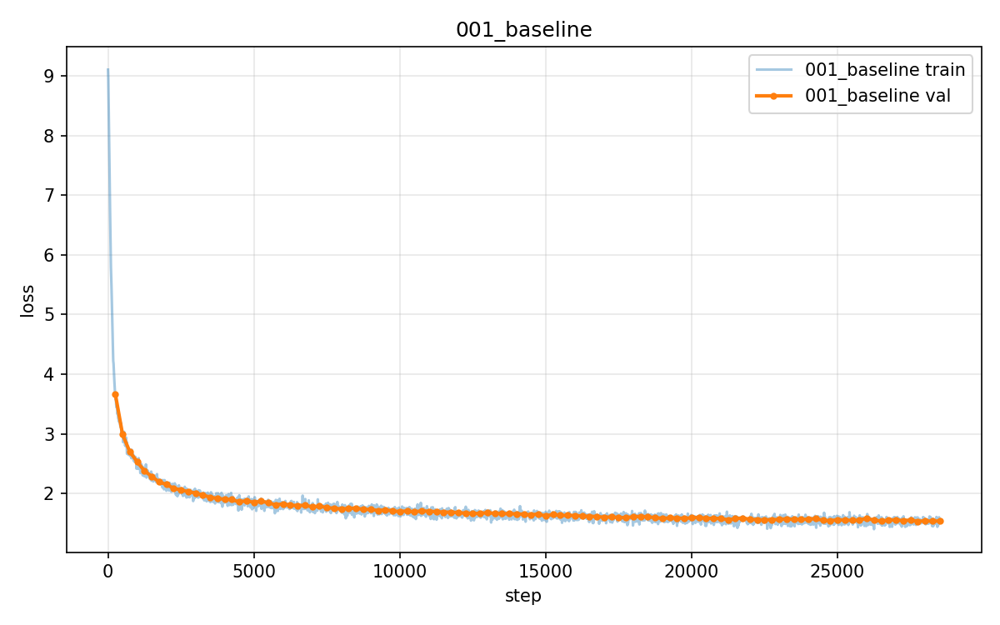
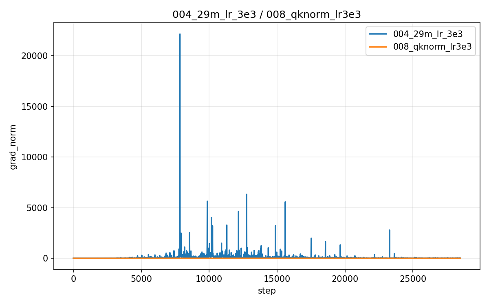
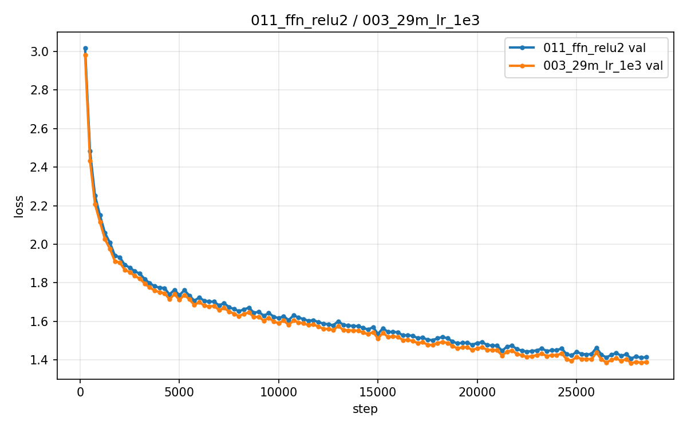
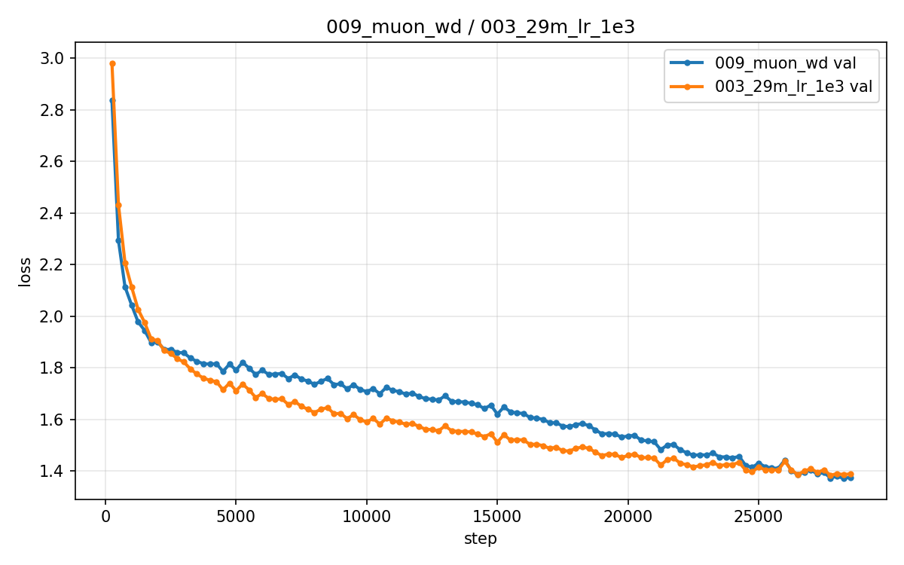
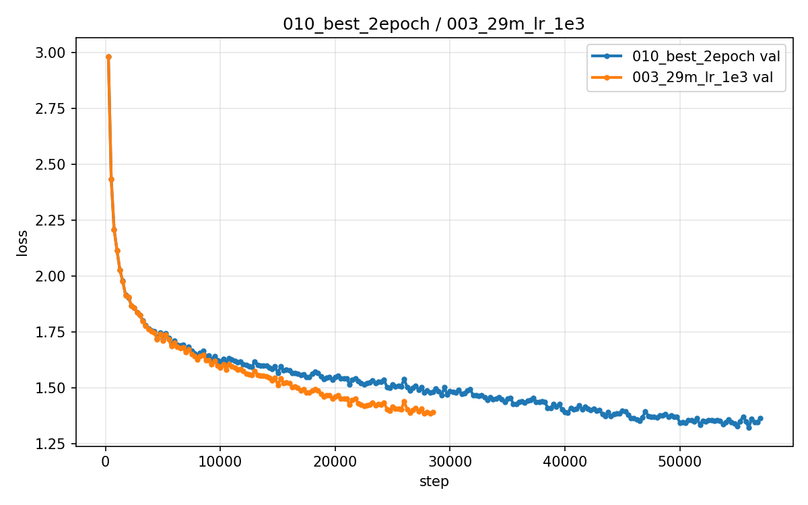

# GPT from Scratch

从零实现的 decoder-only 小语言模型（LLaMA 式架构：RMSNorm + SwiGLU + RoPE），
覆盖 BPE 分词器、数据管线、模型、训练栈与采样推理的完整实现。
模型在全量 TinyStories（约 5 亿 token）上完成训练与验证：
16M 参数基线验证集 loss ≈ 1.53，29M 参数最优配置为 1.3832。

模型、分词器与训练栈全部手写实现，不依赖 `nn.Transformer`、`tiktoken` 与 `transformers.Trainer`。

> 状态：训练技术验证已完成。QK-Norm（1.3746）、Muon v2（1.3716）、ReLU²（1.4083）、
> 2-epoch 重训（1.3212）等结论均已落定；归一化消融与 AttnRes 与基线持平
> （1.3817 / 1.3793 vs 1.3832），数据量消融表明 3M token 严重过拟合（best 2.31），
> 最优组多 seed 均值为 **1.3771 ± 0.0108**。详见 `docs/训练技术验证报告.md`。

## 项目特点

- **全链路从零实现**：BPE 分词器 → 数据管线 → 模型 → 训练 → 采样，无黑盒组件
- **组件级可配置**：归一化（RMSNorm / LayerNorm）、FFN（SwiGLU / GELU / ReLU²）、
  位置编码（RoPE / learned / none）均以配置开关实现；另有 QK-Norm、输出投影
  零初始化、Attention Residuals 深度残差路由、权重绑定等训练技术开关
- **手写优化器**：AdamW（解耦权重衰减）与 Muon（Newton-Schulz 正交化），
  以及 Muon/AdamW 混合分工优化器（Muon 负责矩阵参数，AdamW 负责 embedding/头）
- **多组对照消融**：位置编码（3 组）、学习率（4 组），以及归一化 / FFN /
  数据量消融与训练技术组合实验
- **KV cache 推理优化**：增量 decode，测速数据见下文
- **工程化完备**：pytest 单元测试（42 个）、JSONL 实验日志、checkpoint 断点续训、
  bf16 混合精度、可选 W&B 追踪
- **实验规范化**：每组实验独立目录（config + 日志 + 结论），记录硬件与预处理耗时

## 模型配置

| 参数 | 值 |
|---|---|
| 架构 | LLaMA 式：RMSNorm + SwiGLU + RoPE（pre-norm，无 bias）|
| vocab_size | 8192（BPE 在 TinyStories 训练集上训练）|
| n_layer / n_head / n_embd | 6 / 6 / 384（baseline）；8 / 8 / 512（29M 主力）|
| d_ff（SwiGLU 隐层） | 1344 |
| block_size | 256 |
| 参数量 | ~16M（baseline）/ ~29M（主力）（token embedding 与输出头权重共享）|
| 训练数据 | 全量 TinyStories train（约 5 亿 token）|
| optimizer | AdamW：lr 3e-4，warmup 200，cosine 退火至 3e-5 |
| weight_decay / grad_clip | 0.1 / 1.0 |
| dtype | bf16 |
| 训练技术开关 | qk_norm / zero_init_proj / attn_res / untie（默认关闭）+ optimizer（adamw / muon）|

## 主要结果

| 指标 | 数值 |
|---|---|
| 验证集 loss | 16M baseline：1.5317；29M + 最优 lr：1.3832（fp32 精确复测 1.3979±0.005）|
| 训练吞吐（token/s） | 16M：~207,000；29M：~125,000（单卡 RTX 4090，bf16）|
| 采样（无 KV cache，token/s） | 16M：78.0 GPU / 70.5 CPU；29M：118.1 GPU / 36.3 CPU |
| 采样（KV cache，token/s） | 16M：81.5 GPU（1.04×）/ 115.0 CPU（1.63×）；29M：125.7 GPU（1.06×）/ 63.9 CPU（1.76×）|

> KV cache 加速比随模型规模增大而上升（16M→29M：GPU 1.04→1.06×，CPU 1.63→1.76×），
> 与"模型越大、计算占比越高、缓存收益越大"的理论预期一致。加速比低于参考实现的
> 2.5× 源于本实验模型规模偏小：GPU 上每步耗时由 kernel 启动开销主导，小模型推理
> 的瓶颈不在计算。正确性由逐 token 一致性测试保证。

**示例**（29M 最优模型，lr 1e-3 组 best.pt）：

> Once upon a time, there was a little boy named Timmy. Timmy loved to play with his toys, but he didn't like to clean them up. His mommy would always tell him to do it, but he never listened... He learned that sometimes it's important to do things that are hard to do, even if you don't like it. From that day on, Timmy promised to always listen to his mommy and do what she asked. **<|endoftext|>**

训练曲线与实验图（`assets/`）：

| 图 | 内容 |
|---|---|
|  | 16M baseline 训练全程 |
|  | LR 四组对比（含 3e-3 发散曲线） |
|  | 发散组的梯度范数尖峰（最高 ~22000）与 QK-Norm 组平稳曲线 |
|  | 位置编码三组对比 |
|  | 16M vs 29M |
|  | 最优组 train/val 双曲线 |
|  | warmup + cosine 调度 |
|  | FFN 激活对比：ReLU² vs SwiGLU |
|  | Muon v2 vs AdamW |
|  | 2-epoch 重训 vs 1-epoch |

### 位置编码消融（29M + lr 1e-3，唯一变量 pos_type）

| 位置编码 | 验证集 loss |
|---|---|
| **RoPE（baseline）** | **1.3832** |
| learned | 1.4071 |
| none | 1.4259 |

> 结论：RoPE 最优，与既有研究结论一致。learned 与 none 差距仅 0.019，表明在
> 256 token 短上下文与短故事设置下，可学习绝对位置编码未提供有效增益，而 RoPE
> 的相对位置编码带来稳定收益（-0.04）。none 组在完全无位置信息下仍达 1.4259，
> 说明因果掩码本身携带一定的顺序线索。曲线对比见 `assets/pos_ablation.png`。

### LR 消融（29M，其他条件全同）

| lr | 验证集 loss | 备注 |
|---|---|---|
| 3e-4 | 1.4467 | 收敛稳定，欠拟合 |
| **1e-3** | **1.3832**（fp32 精确复测 1.3979±0.005）| **最优** |
| 1.25e-3（参考项目最优值） | 1.3964 | 与 1e-3 同处最优区间 |
| 3e-3 | 发散（best 2.28 → 反弹 3.3，gnorm ~50） | 学习率过高，不可用 |

> 注：训练日志中的 val loss 为 bf16 + 20 batch 的快速估计；括号内为
> fp32 + 100 batch 的精确复测（`src/eval.py`）。两个参考项目的最优 lr
> 分别为 1.25e-3（H）与 1e-3（L），与本实验结果相互印证。

### 选做消融

| 变量 | 对照组 | 验证集 loss |
|---|---|---|
| 归一化 | RMSNorm / LayerNorm | LayerNorm best 1.3817（@27750），与 RMSNorm 1.3832 基本持平 |
| FFN | SwiGLU / ReLU²（GELU 未做） | ReLU² 1.4083，见 `docs/训练技术验证报告.md` |
| 数据量 | 全量约 5 亿 / 300 万 token | 3M token 严重过拟合：best 2.31@750 → final valid 4.72 |

### 训练技术验证（详见 `docs/训练技术验证报告.md`）

| 技术 | 实验 | 结果 |
|---|---|---|
| **QK-Norm** | lr 3e-3 发散 → +QK-Norm | 发散抑制：2.28（反弹 3.9）→ 1.4020 |
| **QK-Norm 干净归因** | 最优配置（lr 1e-3 / min_lr 3e-5）± QK-Norm | 1.3746 < 最优组 1.3832（-0.0086，真实收益） |
| Muon（vs 手写 AdamW） | v2 补充 decoupled weight decay | v1 复现发散（gnorm~194）；v2 修复后 1.3716 < 最优组 1.3832 |
| ReLU² | vs SwiGLU | 全程接近，最终 1.4083（落后 0.025，节省约 1/3 FFN 计算） |
| 输出投影零初始化 | 最优配置 + zero_init_proj | 1.3933（无增益，默认关闭） |
| 解开权重绑定（untie） | 最优配置 − tie | 1.3823 ≈ 最优组（增加 4.2M 参数，无收益） |
| Attention Residuals | 深度残差路由（Kimi 2024）| 1.3793 ≈ 最优组 1.3832（持平，深层幅值受控）|
| 技术组合（全叠加） | QK+Muon+ReLU²+untied+zero-init | 1.3900（无协同增益，需分别调优各技术） |
| 2-epoch 重训 | 最优配置 ×2 | best 1.3212（+0.062）；final 1.3631（末期过拟合） |
| 多 seed 显著性 | 最优组 seed 1/2/3 | 1.3771 ± 0.0108（n=3，单次 1.3668 / 1.3761 / 1.3883） |

## 采样示例

**示例 1**（prompt: "Once upon a time"，temperature=0.8, top_k=50, top_p=0.95）：

> Once upon a time there was a little girl named Alice. She was only three years old but she was very curious. One day Alice decided to explore her garden. She took a stick and started to poke around the plants... Finally, they found a little patch of colorful flowers that looked like butterflies. Alice was delighted and said, "This is the best garden ever!"

**示例 2**（同参数）：

> Later that day, Timmy's dad came home from work and asked him to help deliver a package to his grandma... Timmy learned that it's important to be careful and not put [it in his mouth]

## 复现步骤

```bash
conda activate <你的环境>        # 需 torch>=2.1, numpy, datasets, matplotlib, pytest, regex
pip install -r requirements.txt

# 1. 数据：下载全量 TinyStories → 训练 BPE → tokenize → 缓存 .bin
#    约需 2GB 磁盘 + 1~2 小时编码（多进程），可用 --hf_cache 指定缓存位置
python scripts/prepare_data.py --vocab_size 8192 --train_token_budget 600000000 --workers 32

# 2. 训练（可用 CUDA_VISIBLE_DEVICES 指定显卡）
bash scripts/run_train.sh

# 3. 采样
python -m src.sample --ckpt experiments/003_29m_lr_1e3/best.pt --benchmark

# 4. 单元测试
pytest tests/ -v
```

> 注意：训练集与验证集必须共享同一套 vocab 与 BPE merges，否则验证集 loss 不可比
> （相关失误记录见 `docs/训练技术验证报告.md` 附录）。

## 目录结构

```
gpt-from-scratch/
├── src/
│   ├── tokenizer.py    # BPE：train / encode / decode
│   ├── data.py         # 随机 chunk 采样 + batch 组装
│   ├── model.py        # LayerNorm / GELU / MLP / 因果注意力 / Block / GPT
│   ├── train.py        # 训练循环（AdamW / warmup / cosine / clip / bf16）
│   ├── sample.py       # top-k / top-p / temperature 采样
│   └── eval.py         # val loss / KV cache 测速
├── scripts/            # prepare_data.py / run_train.sh / smoke_test.py
├── tests/              # test_tokenizer.py / test_model.py
├── experiments/        # 001_baseline/ 002_rope/ 003_lr_sweep/...
├── data/  checkpoints/ # 数据与权重（git 忽略）
└── assets/             # loss_curve.png 等
```

## 参考与致谢

- Karpathy: [nanoGPT](https://github.com/karpathy/nanoGPT) / [minbpe](https://github.com/karpathy/minbpe)
- Stanford [CS336: Language Modeling from Scratch](https://stanford-cs336.github.io/)
- [动手学深度学习 d2l.ai](https://zh.d2l.ai/)
- 参考项目：[LitzGymrat/CS336-LLM_from_scratch-assginment1](https://github.com/LitzGymrat/CS336-LLM_from_scratch-assginment1)、[Hurricane0698/TransformerLM-from-scratch](https://github.com/Hurricane0698/TransformerLM-from-scratch)
