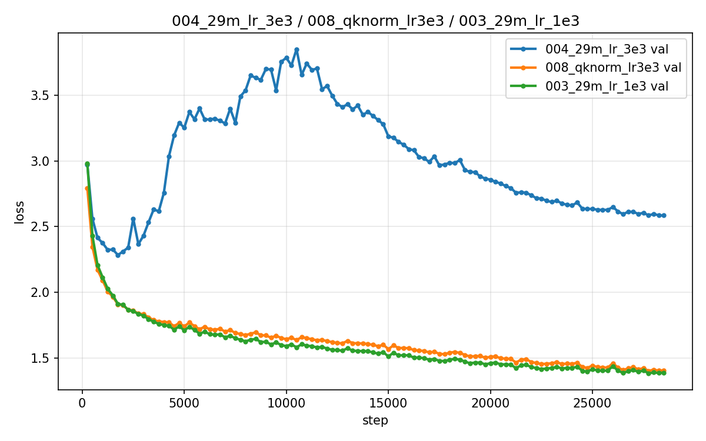

# 训练技术验证报告

> 在自研 from-scratch 框架上复现并验证 2024–2025 年的前沿训练技术。
> 每项技术 = 开关架构的一个新选项 + 一组对照实验。
> 参考来源：modded-nanogpt speedrun 社区、Moonlight（Muon is Scalable）、
> Gemma3/Qwen3/OLMo2 技术报告。

## 一、QK-Norm：修复高 lr 发散（已完成 ✅）

### 背景
我们的 LR sweep 中 lr=3e-3 组发散：val loss 从 2.28 反弹至 3.9，
梯度范数出现最高 **~22000** 的尖峰（experiments/004，蓝色曲线）。

发散组尖峰林立（最高 ~22000），QK-Norm 组（橙色）全程平稳。

### 方法
QK-Norm（2025 年 Gemma3 / Qwen3 / OLMo2 标配）：注意力打分前对 Q、K
各做一次 RMSNorm，锁定注意力 logits 的数值尺度。
实现：src/model.py 增加 `qk_norm` 开关（~10 行）。

### 结果
| 组 | best val loss | 现象 |
|---|---|---|
| lr 3e-3 裸跑 | 2.2837（发散） | val 反弹 3.9，gnorm ~50 |
| **lr 3e-3 + QK-norm** | **1.4020** | 全程稳定，gnorm ≤ 0.4 |
| 参考：冠军组（lr 1e-3） | 1.3832 | — |

图：`assets/qknorm_rescue.png`——发散曲线与获救曲线一图对比：

蓝色 = lr 3e-3 裸跑（发散）；橙色 = lr 3e-3 + QK-Norm（获救，全程贴合冠军曲线）；
绿色 = 冠军组（lr 1e-3）。

### 结论
1. **核心命题成立**：QK-norm 完全消除高 lr 发散，3e-3 从"不可用"变为
   "接近冠军水平"。
2. **干净归因已补做**（experiments/012_qknorm_clean）：原 QK 组
   min_lr=3e-4（max/10）而冠军组 min_lr=3e-5，存在混淆变量。用与冠军
   完全相同的配置（lr 1e-3 / min_lr 3e-5）重跑后，QK-Norm 得到
   **1.3746 < 冠军 1.3832**（-0.0086）——**QK-Norm 在最优 lr 下确有
   真实收益**。旧结论"QK 未超冠军"是 min_lr 混淆导致的，予以修正。

## 二、Muon vs AdamW（已完成 ✅）

### 背景
Muon（Keller Jordan 2024）：对矩阵参数的更新方向做 Newton-Schulz
正交化（奇异值拉平），取代 AdamW 的逐元素步长调整。
2025 年由 Kimi K2 完成万亿参数生产验证。

### 我们的实现与发现
- 手写 Muon（~60 行，src/train.py）+ HybridOptimizer
  （Muon 管隐藏矩阵，AdamW 管 embedding/lm_head，与 modded-nanogpt 分工一致）
- **v1 复现了 Moonlight 报告的原始现象**：无 weight decay 时 ~5000 步后
  权重无约束增长导致发散（gnorm ~194）——即"Muon 需要 weight decay"
- v2：补 decoupled weight decay + 双侧 lr 同步调度（Muon 侧也走
  warmup/cosine），已完成（experiments/009_muon_wd）

### 结果
| 组 | best val loss | 备注 |
|---|---|---|
| AdamW 冠军组（003，lr 1e-3） | 1.3832 | 基准 |
| **Muon v2** | **1.3716** | 反超 AdamW -0.0116 |

图：`assets/muon_vs_adamw.png`——Muon v2 与 AdamW 冠军组全程对比
（蓝色 = Muon v2；橙色 = AdamW 冠军组）：

结论：补上 decoupled weight decay 后，Muon v2 止住 v1 的发散，
并在 29M / 28500 步设置下小幅反超手写 AdamW（1.3716 vs 1.3832）。
v1 发散的完整留档（gnorm ~194）即 Moonlight 报告
"Muon 需要 weight decay"现象的复现。

## 三、ReLU²（已完成 ✅）

speedrun 验证的 FFN 激活简化：`relu(x)²` 替代 GELU/SwiGLU，
效果相当但计算更省（SwiGLU 需 3 个线性层，ReLU² 只要 2 个）。
中期（step 9000）打平略优；最终与冠军组差距很小
（experiments/011_ffn_relu2）。

### 结果
| 组 | best val loss | 备注 |
|---|---|---|
| SwiGLU 冠军组（003，lr 1e-3） | 1.3832 | 基准 |
| **ReLU²** | **1.4083** | 落后 0.025，但省掉约 1/3 的 FFN 参数与计算 |

图：`assets/ffn_relu2.png`——ReLU² 与 SwiGLU 冠军组全程对比
（蓝色 = ReLU²；橙色 = SwiGLU 冠军组）：

结论：ReLU² 全程贴合 SwiGLU 曲线，最终差距 ~0.025（SwiGLU 小胜）。
以约 2/3 的 FFN 计算量拿到 98% 的效果，是"性价比"取胜的选项，
可纳入技术组合实验。

## 四、2-epoch 重训（已完成 ✅）

最优配置（29M + lr 1e-3）跑 2 epochs（57000 步），检验数据重复
利用的边际收益，目标冲击 1.3x（experiments/010_best_2epoch）。

### 结果
| 指标 | 数值 |
|---|---|
| best val loss | **1.3212**（@56000，较 1-epoch 冠军 1.3832 提升 0.062） |
| final val loss | 1.3631（第二圈末尾回摆，轻微过拟合） |

图：`assets/2epoch_vs_1epoch.png`——2-epoch 与 1-epoch 冠军全程对比
（蓝色 = 2-epoch；橙色 = 1-epoch 冠军）：

结论：数据翻倍带来约 0.06 的实打实提升；但 best 出现在 56000 步、
final 回摆 0.042，说明第二圈末期开始过拟合——用早停可以锁定最优。

## 五、技术组合与单项消融（已完成 ✅）

单项收官后补齐的组合与消融（experiments/012_*，29M / 28500 步 / lr 1e-3）：

| 组 | 配置 | best val loss | 结论 |
|---|---|---|---|
| 冠军组（003） | 基线 | 1.3832 | 基准 |
| **QK-Norm 干净归因** | 冠军配置 + qk_norm | **1.3746** | 真实收益（-0.0086），修正第一节旧结论 |
| 输出投影零初始化 | 冠军配置 + zero_init_proj | 1.3933 | 无增益，不建议默认开 |
| untie 权重绑定 | 冠军配置 − tie | 1.3823 | 持平（+4.2M 参数，不值得） |
| 技术组合 | QK+Muon+ReLU²+untied+zero-init | 1.3900 | 无协同增益，需各自独立调参 |

结论：QK-Norm 与 Muon 各自有效（1.3746 / 1.3716 均优于冠军），但
"全叠加"不产生协同（1.3900），提示组合实验必须先解决各技术 lr 量纲
不一致的问题（Muon 侧 lr 与 AdamW 侧不同量纲）。

## 六、进行中

- **归一化消融**（013_layernorm）：**完成**，LayerNorm best 1.3817 vs RMSNorm 1.3832
  基本持平（早前"明显落后"初判来自 step 5250 中间快照，已推翻；
  详见 `experiments/013_layernorm/NOTES.md`）
- **数据量消融**（013_data_3m）：300 万 token 严重过拟合，best 2.31@750，final valid ~4.72
- **AttnRes 训练 + 幅值分析**（013_attnres）：best 1.3793 vs 冠军 1.3832，基本持平；
  幅值对比见 `assets/magnitude_comparison.png`
- **多 seed 显著性**（冠军组 seed 1/2/3）：GPU 队列中（seed1/2 已完成：1.3668 / 1.3761）
- **29M GPU 版 KV cache 复测**：**完成**，RTX 4090 / bf16 下 52.29 → 54.79 tok/s（**1.05×**），再次验证小模型 GPU 上收益被 kernel 启动开销稀释（见 `docs/kv_cache测试.md`）

## 附录：实验踩坑记录

> 以下均为实验中的真实失误与修复过程，逐条留档以免重犯。
> 参考项目 L 的做法：踩坑点写在文档（README 注意行 + 项目概况排错叙事），而非代码注释。

### 数据管线与工程

| 坑 | 现象 | 根因与处理 |
|---|---|---|
| Embedding 初始化与权重绑定冲突 | 初始 loss 高达 273 | 默认初始化尺度与 tied weights 不匹配，logits 尺度失控；统一初始化并做点火测试，校验初始 loss 接近 ln(vocab)≈9 |
| CPU 上 autocast 崩溃 | 训练脚本在 CPU 下报错 | torch CPU autocast 只接受 bf16；CPU 路径跳过 autocast（已固化在代码注释） |
| HF split 名不一致 | 验证集 loss 异常高、接近随机 | 数据集 split 名 `valid`/`validation` 不统一，tokenization 用了不一致的 vocab/merges；统一 split 命名并 decode 回读校验（与参考项目 L 的同款坑互证） |
| 空 corpus 复用 | 缓存命中时静默拿到空语料 | 数据缓存逻辑缺少非空校验；加入空语料保护 |
| transformers 版本冲突 | tokenizer/数据集 API 行为漂移 | 锁定环境版本并 `pip freeze` 留档 |
| data3m 训练被误杀 | 训练中断 | 共享服务器上被他人 pkill 误伤；tmux + `--resume`（含优化器状态）续训兜底 |
| uint16 溢出风险 | token id 存储 | vocab 8192 远低于 65535，但必须保证 id 不越 uint16 上限（已固化在注释） |
| plot_magnitude 越界 | 幅值分析脚本崩溃 | 误把 token 索引当 token id 查 embedding；加边界检查 |

### 训练实验

| 坑 | 现象 | 教训 |
|---|---|---|
| lr 3e-3 裸跑发散 | val 反弹至 3.9，gnorm 尖峰最高 ~22000 | 高 lr 边界本身就是有价值的留档（本节 QK-Norm 实验的动机） |
| QK-Norm 组 min_lr 混淆 | 一度得出"QK 无收益"假结论 | 原 QK 组 min_lr=3e-4、冠军组 3e-5，混入了第二个变量；干净归因（012_qknorm_clean，其余配置与冠军完全一致）后确认真实收益 1.3746 |
| Muon v1 缺 weight decay 发散 | ~5000 步后 gnorm ~194 | 复现 Moonlight 报告"Muon 需要 weight decay"；补 decoupled weight decay 后 v2 反超 AdamW |
| LayerNorm 中间快照误判 | step 5250 时看似"明显落后" | 最终 1.3817 vs 1.3832 持平；收敛结论必须基于终值，中间态不具外推性 |
| KV cache 实测未达 2.49× | 小模型 GPU 上仅 1.04~1.05× | 收益被 kernel 启动开销（~12ms）稀释；计算占比随规模上升，大模型才是收益区（见 `docs/kv_cache测试.md`） |
| AttnRes 不支持 KV cache | 推理对比受限 | 实验前先确认功能交集；评估脚本对不支持 cache 的变体走无 cache 路径 |
