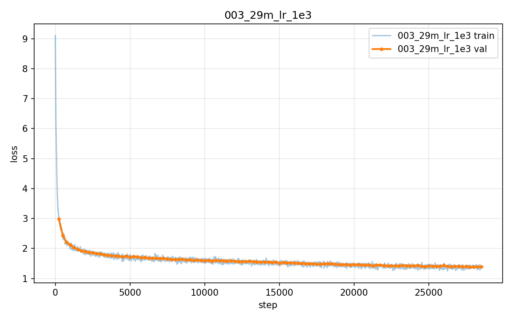
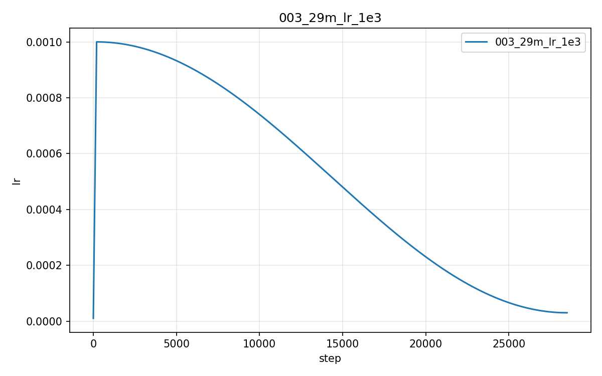
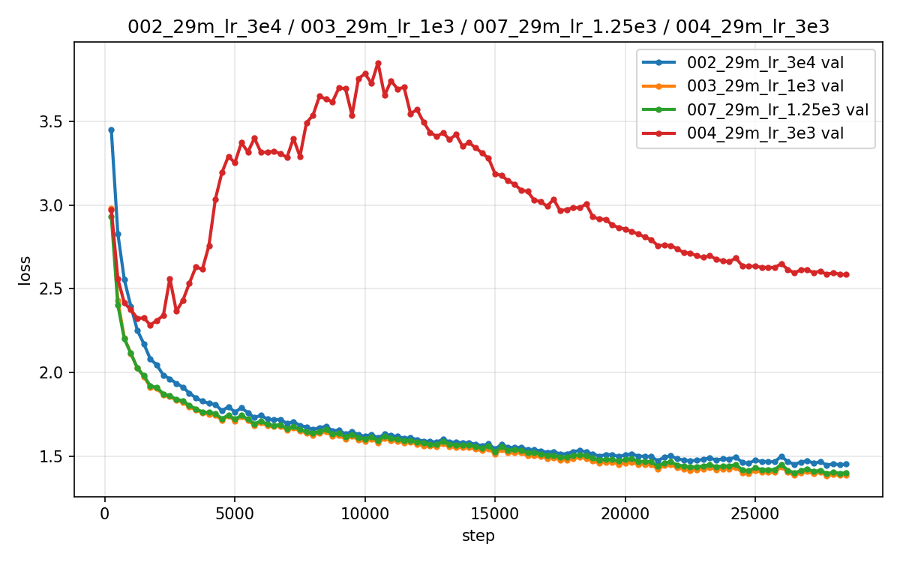
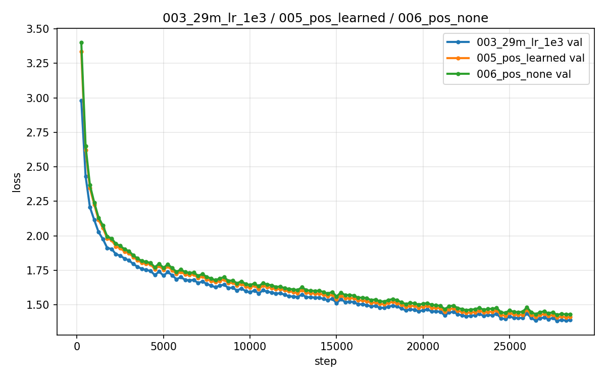
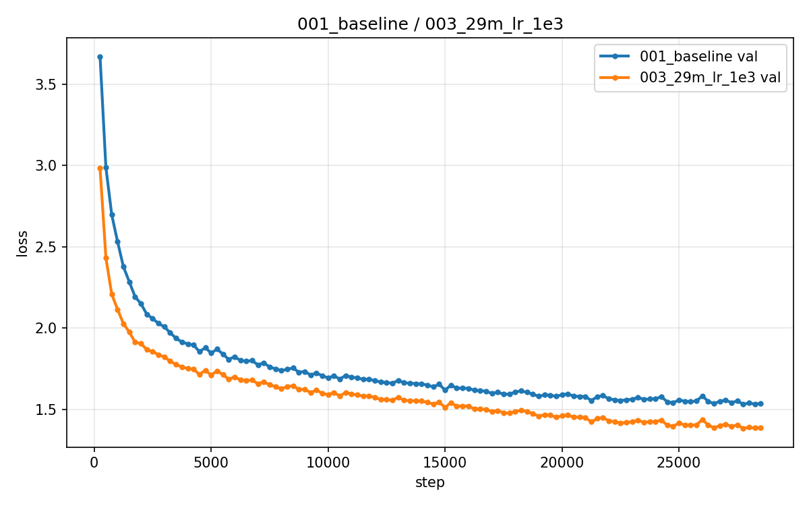

# GPT-from-scratch 项目全生命周期总结

> 对标 CS336 Assignment 1 完成的从零实现 LLM 项目。
> 本文档为阶段性总结，数字以最终实验结果为准（消融与训练技术验证已收官）。

## 第一部分：客观概括完成了什么

这个项目走通了 **"分词器 → 数据管线 → 模型 → 训练栈 → 采样推理 → 推理加速 → 消融实验"** 的完整链路，且所有核心组件均为手写，未使用 `nn.Transformer` / `tiktoken` / `torch.optim.AdamW` / `F.scaled_dot_product_attention` 等高阶 API。

### A. 从零实现的组件清单

**分词器（纯 Python，仅依赖 regex 库）**
- 字节级 BPE 训练（256 基础字节 + 特殊 token + 增量式合并优化：倒排索引 + 增量计数）
- encode/decode/save/load 全流程；单词级缓存加速语料编码
- GPT-2 官方预分词正则；decode 先拼字节再解码（防多字节字符切碎）

**模型（LLaMA 式，全部手写 forward）**
- RMSNorm / LayerNorm（fp32 上转保护）、SwiGLU / GELU-MLP（手写 erf 精确式）
- RoPE（cos/sin 表 `persistent=False`，按绝对位置查表）
- 手写数值稳定 softmax、手写因果注意力（掩码对角线偏移统一 prefill/decode）
- **三个组件开关**：norm_type / ffn_type / pos_type——消融实验的架构基础

**训练栈（全部手写）**
- AdamW（解耦权重衰减、动量估计、偏差修正、norm/bias 不衰减、绑定参数去重）
- warmup + cosine 学习率调度、全局范数梯度裁剪、logsumexp 交叉熵（fp32）
- bf16 混合精度、checkpoint 断点续训（含优化器状态）、JSONL 日志逐行 flush

**采样与推理**
- temperature / top-k / top-p（向量化 nucleus：sort→cumsum→掩码右移）
- KV cache：先 RoPE 后拼接、位置从缓存长度推断；prefill/decode 两阶段

### B. 数据管线

- TinyStories 全量：train 4.67 亿 token（212 万篇）/ valid 469 万 token
- 流式下载（HF 镜像）→ 训练 BPE（vocab 8192）→ 32 进程并行编码 → uint16 memmap
- 内置 sanity check（解码回读）；压缩率 4.25 bytes/token

### C. 训练成绩

| 实验 | 配置 | best val loss |
|---|---|---|
| 001 baseline | 16M，lr 3e-4，1 epoch | 1.5317（精确复测 1.5468±0.005） |
| **003 LR sweep 冠军** | **29M，lr 1e-3，1 epoch** | **1.3832（精确复测 1.3979±0.005）** |

29M 模型生成的故事结构完整（起因→冲突→解决→寓意），并以 `<|endoftext|>` 正常收尾。
冠军组（003）完整训练曲线：

LR 调度的真实形状（warmup 线性爬升 → cosine 退火）：

## 第二部分：消融实验（本项目的方法论核心）

### LR sweep（29M，四组并行，唯一变量 max_lr）

| lr | best val loss | 现象 |
|---|---|---|
| 3e-4 | 1.4467 | 欠拟合 |
| **1e-3** | **1.3832** | 最优 |
| 1.25e-3（参考项目 H 的最优值） | 1.3964 | 与 1e-3 同处盆地底部 |
| 3e-3 | 2.2837（发散） | val 反弹至 3.9，gnorm 飙至 ~50 |

结论：最优 lr 在 1e-3 附近的平缓盆地；发散组完整留档。

### 位置编码消融（rope / learned / none，29M + lr 1e-3）

| pos_type | best val loss |
|---|---|
| **rope** | **1.3832** |
| learned | 1.4071 |
| none | 1.4259 |

结论：RoPE 最优（复现教科书预期）；**learned ≈ none（差距仅 0.019）**——
短上下文设置下可学习绝对位置几乎无价值，而 RoPE 的相对编码有稳定收益。
none 组无位置信息仍达 1.43：因果掩码隐式泄露顺序线索。

### 规模对比（16M vs 29M）

同 step 7000 左右：16M val 1.80 vs 29M val 1.64。数据配比充足（29 token/参数）时，
放大模型收益明显。29M 全程领先：

## 第三部分：KV cache——一次"未达标但更有价值"的优化

**正确性**：逐 token 等价测试（贪心下 cache/无 cache 输出完全相同）。

**实测加速比**：
| 环境 | 16M | 29M |
|---|---|---|
| GPU（bf16） | 1.04× | 1.05×（复测，52.29 → 54.79 tok/s） |
| CPU（fp32） | 1.63× | 1.76× |

未达参考项目的 2.49×，原因分析（比数字本身更有价值）：
1. 小模型 + 短序列下，GPU 每步耗时由 kernel 启动开销（~12ms）主导，
   cache 省掉的计算（~0.1ms）占比太小；
2. CPU 上计算是真瓶颈，加速比立刻显现（1.63×）；
3. 加速比随模型规模上升（16M→29M：1.63→1.76），与理论一致——
   KV cache 的收益在大模型上才会充分体现。

## 第四部分：工程纪律

- **42 个单元测试全绿**：手写组件 vs PyTorch 官方实现的数值对照
  （注意力/LayerNorm/GELU/AdamW/交叉熵）、18 种开关组合、因果性、
  KV cache 等价性、端到端过拟合点火测试
- **实验目录规范**：每组实验 = config.json + log.jsonl（逐行 flush）
  + best.pt + NOTES.md（Goal/Setup/Results/Limitations/Next steps）
- **踩坑记录**（全部转化为代码注释或测试）：
  Embedding 初始化与权重绑定冲突（初始 loss 273）、CPU autocast dtype 校验、
  HF split 名 valid/validation、空 corpus 复用、transformers 版本冲突等

## 第五部分：局限与下一步

- 单 seed，未做多次重复实验的显著性检验
- min_lr 未严格统一为 max_lr/10
- 已完成：位置编码消融、2-epoch 重训（best 1.3212）、技术组合与单项消融
  （QK-Norm 干净归因 1.3746 / zero-init 1.3933 / untie 1.3823 / combo 1.3900，
  详见 `docs/训练技术验证报告.md` 第五部分）
- 已完成：数据量消融（3M 严重过拟合，best 2.31）、AttnRes 训练与幅值分析
  （best 1.3793 与冠军持平，深层幅值受控，见 `assets/magnitude_comparison.png`）
- 进行中：多 seed 显著性（冠军组 seed 1/2/3，seed1/2 已完成 1.3668 / 1.3761）
  （归一化消融已完成：LayerNorm 1.3817 与 RMSNorm 1.3832 基本持平）
- 已完成：29M GPU 版 KV cache 复测（RTX 4090 / bf16 下 **1.05×**，52.29 → 54.79 tok/s，
  验证小模型 GPU 上收益被 kernel 启动开销稀释，见 `docs/kv_cache测试.md`）
